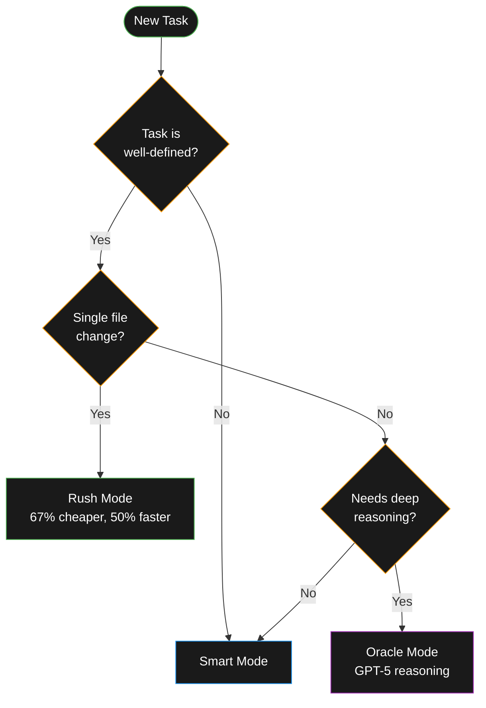

**TL;DR:**

- Rush mode: 67% cheaper, 50% faster—for small, well-defined tasks
- Subagents: parallelize independent work or isolate complex subtasks
- Oracle: deep reasoning, planning, debugging across multiple files (uses GPT-5)
- Librarian: search public/private GitHub repos for cross-repo insights

> **📖 Quick Start**
>
> - **Who it's for:** Developers ready to optimize agent workflows
> - **Time to complete:** 30 minutes reading + exercises
> - **Prerequisites:** [Core workflows mastered](/posts/agent-workflows-that-stick)
> - **Expected outcome:** Know when to use Rush, Oracle, Subagents, and Librarian
> - **Next step:** [Set up planning workflow](/posts/agent-planning-workflow)

## Choosing Your Mode: Rush vs Smart vs Oracle

Not all tasks need the same horsepower. Pick based on complexity, not urgency.



### Rush Mode

**When to use:**

- Small, well-defined tasks
- Clear success criteria
- Single file changes
- You've done similar work before

**Examples:**

- "Remove all console.log statements"
- "Fix this TypeScript error in Header.tsx"
- "Add a loading spinner to this button"
- "Update imports after moving a file"

**How to use:**

```text
Switch mode to Rush (Amp UI/command palette), then:

Remove all console.log and debugger statements from @src/
```

**Why it works:** 67% cheaper, 50% faster (uses Claude Haiku 4.5)

**When it doesn't:** Complex tasks, vague goals, architectural decisions

### Smart Mode (Default)

**When to use:**

- Complex refactoring
- Feature implementation
- Multi-file changes
- Needs full context and reasoning

**Examples:**

- "Refactor authentication to use JWT tokens"
- "Add dark mode toggle with theme persistence"
- "Implement infinite scroll with intersection observer"

**How to use:** Just prompt normally—smart mode is the default

**Why it works:** Uses Claude Sonnet 4.5, unconstrained context

### Oracle Mode

**When to use:**

- Deep code analysis
- Architecture planning
- Complex debugging
- Design reviews

**Examples:**

- "Review this API design and suggest improvements"
- "Analyze why this component re-renders excessively"
- "Plan how to migrate from REST to GraphQL"
- "Debug this race condition in the state management"

**How to use:**

```text
Oracle: review this API design. List trade-offs and risks.
Give a 2-step recommendation for improving error handling.
```

**Why it works:** Uses GPT-5 for complex reasoning, sees patterns across files

**Cost:** More expensive, but worth it for critical decisions

## Subagents: Parallelize and Isolate

Subagents are independent agents that run in parallel or handle isolated subtasks without polluting your main thread.

### When to Use Subagents

**Parallelize independent work:**

- Convert multiple CSS files to Tailwind
- Migrate multiple components to TypeScript
- Update multiple config files

**Isolate complex subtasks:**

- "Search the codebase for auth patterns" (without cluttering main thread)
- "Research how we handle feature flags" (uses Librarian)
- "Build a prototype in a sandbox" (separate from production work)

### How to Use Subagents

**Parallel work:**

```text
Use 3 subagents to convert these CSS files to Tailwind:
- @components/Header.css
- @components/Footer.css
- @components/Sidebar.css

Each subagent should preserve all styles and verify
the component still renders correctly.
Only modify files listed above; don't touch unrelated components.
```

**Search and research:**

```text
Use a subagent to find all places where we validate
user input. Summarize the patterns.
```

**Prototype/experiment:**

```text
Spawn a subagent to build a quick prototype of real-time
sync using WebSockets. Don't modify production code.
```

### What Happens

- Each subagent gets its own isolated context
- They run independently (parallel or sequential)
- Results are summarized back to your main thread
- Main thread stays clean and focused

### Pitfalls

**Over-parallelization:**

```text
❌ Use 10 subagents to refactor 10 files
   (coordination overhead, merge conflicts)

✅ Use 3 subagents for 3 independent modules
   (clear boundaries, minimal conflicts)
```

**Stale context:**

- Subagents don't see each other's changes
- Keep tasks truly independent
- Review and integrate results carefully

## Oracle: Your Second Brain for Hard Problems

The Oracle is a specialized reasoning agent (GPT-5) that excels at:

- Architecture and design reviews
- Complex debugging
- Multi-file analysis
- Planning large changes

### When to Invoke the Oracle

**Design reviews:**

```text
Oracle: review this API design for the user service.
- Analyze REST endpoints and data flow
- List security concerns and edge cases
- Suggest 2-3 improvements with trade-offs
```

**Debugging:**

```text
Oracle: analyze why the checkout flow fails intermittently.
- Check UserCart.tsx, CheckoutService.ts, and payment API
- Identify race conditions or state management issues
- Recommend a fix with test strategy
```

**Planning:**

```text
Oracle: plan the migration from Redux to Zustand.
- Identify all Redux usage
- Suggest migration order (least to most critical)
- List risks and rollback strategy
```

### Oracle Best Practices

**Be specific about what to analyze:**

```text
✅ Oracle: analyze authentication in auth/
   Check token refresh logic and session management.

❌ Oracle: check the auth stuff
```

**Ask for structured output:**

```text
Oracle: review this code.
Give me:
1. Current issues (with line numbers)
2. Improvement suggestions (prioritized)
3. One quick win I can implement today
```

**Provide files explicitly:**

```text
Oracle: review these files for performance issues:
- @components/DataTable.tsx
- @hooks/useDataFetch.ts
- @api/userService.ts
```

## Librarian: Cross-Repo Code Intelligence

The Librarian searches public and private GitHub repositories to find:

- Implementation examples
- Best practices
- Framework/library usage patterns
- Dependency connections

### When to Use the Librarian

**Find prior art:**

```text
Use Librarian to find how we implement feature flags
across all org repositories.
```

**Research framework patterns:**

```text
Use Librarian to find examples of Next.js server actions
in public repositories. Focus on error handling.
```

**Understand dependencies:**

```text
Use Librarian to find how other projects use the
@company/design-system package. Show authentication
examples.
```

**Discover best practices:**

```text
Use Librarian to research database migration strategies
in TypeScript projects. Compare Prisma vs Drizzle usage.
```

### How to Use the Librarian

**Specify scope:**

```text
✅ Search our organization's private repos for "webhook retry"

❌ Find webhook stuff
```

**Focus the search:**

```text
Librarian: find feature flag implementations in our monorepo.
Filter for TypeScript files in services/ directories.
Show initialization and usage patterns.
```

### Librarian Limitations

- Requires GitHub connection configured
- Public repos only (unless org access granted)
- Better for patterns than specific implementations
- Results may need local verification

**Pro tip:** Ask for code blocks and file paths in results to speed verification.

## Handoff: Fresh Context Without Losing Progress

Handoff extracts relevant context from a long thread into a new, focused thread.

### When to Use Handoff

**Context getting too large:**

```text
Use Handoff from the command palette.
Goal: Continue implementing user dashboard with the
decisions we made about data fetching and state management.
```

**Switch focus:**

```text
Use Handoff from the command palette.
Goal: Take the authentication work and now add
authorization with role-based access control.
```

**Clean slate for next phase:**

```text
Use Handoff from the command palette.
Goal: Testing phase—write tests for all the features
we just implemented.
```

### What Handoff Does

1. Analyzes current thread
2. Extracts relevant context for your new goal
3. Creates a new thread with focused context
4. Generates a starter prompt

**Result:** Fresh thread, no context rot, ready to continue.

## Cost and Time Tips

**Optimize for both:**

- Use Rush for small tasks (saves 67% on tokens)
- Use Smart for most work (best balance)
- Use Oracle sparingly (expensive but worth it for critical decisions)

**Monitor token usage:**

- Bottom of Amp sidebar in VS Code
- After each turn in CLI

**Guardrails that still move fast:**

- Cap exploration: "Check only the auth/ directory"
- Focused reads: "Read just the function signatures"
- New threads: Start new threads around 50–100k tokens; beyond ~100k quality degrades

## Failure Modes and How to Avoid Them

### Over-Parallelization

**Problem:** Spawning 10 subagents for coupled work
**Fix:** Use subagents only for truly independent tasks

### Stale Context

**Problem:** Subagents working with old file states
**Fix:** Review and integrate results; don't spawn subagents for tightly coupled changes

### Noisy Diffs

**Problem:** Agent changes 50 files when only 5 were needed
**Fix:** Be explicit in prompts: "Only modify files in components/"

### Oracle Overuse

**Problem:** Asking Oracle for simple tasks (waste of cost/time)
**Fix:** Reserve Oracle for complex reasoning, planning, debugging

### Librarian Rabbit Holes

**Problem:** Searching too broadly, getting overwhelming results
**Fix:** Focus searches with specific terms, file types, or patterns

## Real Example: Migrating CSS to Tailwind

**Task:** Migrate 10 component stylesheets to Tailwind.

**Approach:**

**Step 1: Plan with Oracle**

```text
Oracle: analyze these 10 CSS files and plan the migration
to Tailwind. Identify:
- Common patterns we can templatize
- Complex styles that need custom Tailwind config
- Suggested migration order (easiest to hardest)
```

**Step 2: Parallelize with Subagents**

```text
Use 3 subagents to migrate these components:

Subagent 1:
- Header.css → Header.tsx
- Footer.css → Footer.tsx

Subagent 2:
- Sidebar.css → Sidebar.tsx
- Navigation.css → Navigation.tsx

Subagent 3:
- Card.css → Card.tsx
- Button.css → Button.tsx

Each should preserve styles, verify in Storybook,
and create a summary of changes.
```

**Step 3: Review and Integrate**

```text
Review subagent diffs, stage good changes, test in browser.
```

**Step 4: Verify with Rush**

```text
Switch mode to Rush (Amp UI/command palette), then:

Update remaining 4 simple components using the pattern
established by the subagents.
```

**Time:** 30-40 minutes for 10 components (vs 2-3 hours manually)

## Takeaways

**Pick the right tool:**

- **Rush:** Small, clear tasks
- **Smart:** Most day-to-day work
- **Oracle:** Critical decisions, complex debugging
- **Subagents:** Independent parallelizable work
- **Librarian:** Cross-repo research
- **Handoff:** Fresh context without losing progress

**When to level up:**

- Simple prompts working → Add Rush mode for speed
- Complex tasks appearing → Invoke Oracle for deep analysis
- Multiple independent tasks → Use subagents to parallelize
- Need examples from other repos → Use Librarian
- Thread getting long → Use Handoff

**When to stay simple:**

- Default Smart mode handles 80% of work
- Don't over-engineer with subagents
- Don't burn Oracle credits on simple tasks

## Try This Week

> **🔨 Try It Now: Power Pattern Exercises**
>
> **Exercise 1: Rush vs Smart Comparison**
>
> **Task:** Experience the speed difference
>
> **Rush mode prompt:**
>
> ```text
> Switch mode to Rush, then:
> Remove all TODO comments from @src/components/ and verify build succeeds.
> ```
>
> **Verification:** Build passes, all TODOs gone, check token usage
>
> **Then try Smart mode for comparison:**
>
> ```text
> Switch mode to Smart, then:
> Refactor error handling in @utils/ to use a consistent pattern.
> ```
>
> **Expected outcome:** Understand when to use each mode
>
> **Exercise 2: Oracle Plan Review**
>
> **Task:** Get deep analysis before coding
>
> **Prompt:**
>
> ```text
> Oracle: review the plan in .agents/plans/todo/[feature].md
> Simplify to minimal viable implementation. Flag over-engineering.
> List 3 risks and suggest one quick win to start with.
> ```
>
> **Verification:** Oracle finds simpler approach or catches issues
> **Expected outcome:** Avoid hours of unnecessary work
>
> **Exercise 3: Subagent Parallel Work**
>
> **Task:** Parallelize independent changes
>
> **Prompt:**
>
> ```text
> Use 3 subagents to add PropTypes to these components:
> - @components/Header.tsx
> - @components/Footer.tsx
> - @components/Sidebar.tsx
>
> Each subagent should only modify its assigned file.
> Verify PropTypes are correct and build succeeds.
> ```
>
> **Verification:** All 3 files updated independently, no conflicts
> **Expected outcome:** 3x faster than sequential changes
>
> **Expected outcome:** Know exactly when to reach for advanced modes.

**Pick one power pattern and apply it:**

1. **Rush mode:** Convert 10 CSS files to Tailwind utility classes
2. **Subagents:** Migrate 5 components to TypeScript in parallel
3. **Oracle:** "Review the authentication system and suggest security improvements"
4. **Librarian:** "Find how other teams implement feature flags in Next.js"
5. **Handoff:** Take a long thread and extract context for the next phase

## Slide Outline

Want to present this? Here's a 10-slide outline:

1. **Why modes matter** - Not all tasks need same horsepower
2. **Decision tree** - When to use Rush vs Smart vs Oracle
3. **Rush examples** - Small, well-defined tasks (console.log removal)
4. **Smart default** - Complex refactoring, feature implementation
5. **Oracle requests** - Deep analysis, architecture planning
6. **Subagents do/don't** - Parallelize independent, not coupled work
7. **Librarian scope** - Cross-repo research and examples
8. **Handoff** - Fresh context without losing progress
9. **Pitfalls checklist** - Over-parallelization, stale context, noisy diffs
10. **Try this week** - Pick one power pattern and apply it

---

**Next:** [Set Up Planning Workflow](/posts/agent-planning-workflow) — Use Oracle and .agents/plans structure to prevent rewrites.

**Practice Path:**

1. [What is an Agent](/posts/what-is-an-agent)
2. [First Win in 15 Minutes](/posts/amp-first-win-15-minutes)
3. [Workflows That Stick](/posts/agent-workflows-that-stick)
4. **You are here**: Power Patterns
5. [Planning Workflow](/posts/agent-planning-workflow)

**Related:**

- [Coding with Agents in 2025](/posts/coding-with-agents-2025) — The complete overview

**Resources:**

- [Amp Manual](https://ampcode.com/manual) — Complete feature reference
- [Raising an Agent](https://www.youtube.com/playlist?list=PL6zLuuRVa1_iUNbel-8MxxpqKIyesaubA) — Deep dive into Amp's architecture
