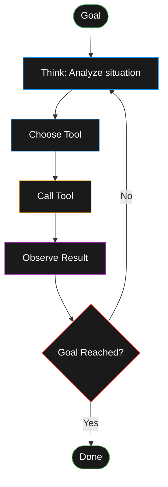

**TL;DR:**

- Coding agents run tools in a loop to achieve your goals—no magic, just good engineering
- Small wins compounded beat big ambitious failures—start simple, iterate fast
- Short threads + clear goals + feedback loops = reliable results

> **📖 Quick Start**
>
> - **Who it's for:** Developers new to coding agents
> - **Time to complete:** 20-30 minutes reading
> - **Prerequisites:** None—this is the overview
> - **Expected outcome:** Complete mental model + first prompts to try
> - **Next step:** [Get your first win in 15 minutes](/posts/amp-first-win-15-minutes)

## Why Agents Now?

The shift from copilots to agents happened when LLMs learned to:

- Use tools reliably (read files, run commands, edit code)
- Chain actions in a loop until goals are met
- Learn from observations and adjust their approach

An agent is just **an LLM calling tools in a loop to achieve a goal**. (Credit: [Simon Willison](https://simonwillison.net/2025/Sep/18/agents/))

## What "Good" Looks Like

Good agent work isn't about grand architectural changes—it's small wins compounded:

- Fix failing tests and verify they pass
- Add a dark mode toggle and confirm it renders
- Refactor a component and check the build succeeds
- Clean up debug statements across 20 files

Each task: clear goal, feedback loop, verification.

## The Core Loop

```text
goal → think → choose_tool → call_tool → observe_result
    → decide: done? otherwise refine and loop
```



This loop is why agents work. They don't just generate code—they:

- Run it
- See errors
- Fix them
- Verify the fix
- Repeat

## The Amp Mindset

[Amp](https://ampcode.com/) is built on four principles:

1. **Unconstrained token usage** - no artificial context limits
2. **Always uses the best models** - multi-model approach for each task
3. **Raw model power** - full access to AI capabilities
4. **Built to evolve** - adapts with new models

In practice, this means:

- **Clear goals**: "Fix TypeScript errors and re-run build until it passes"
- **Feedback loops**: Let the agent run tests, see screenshots, verify results
- **Git discipline**: Stage good changes, discard bad ones

> **💡 Token Management:** Start new threads around 50–100k tokens; beyond ~100k quality degrades. For comprehensive token hygiene best practices, see [Cost and Time Tips in Power Patterns](/posts/amp-power-patterns#cost-and-time-tips)

## Three Workflows to Master

### 1. First Win in 15 Minutes

Pick a small task (failing test, UI tweak), give it to the agent with a verification step, review the diff, done.

**Example prompt:**

```text
Run the tests, list failures, fix one file at a time, re-run.
Stop after green.
```

### 2. Workflows That Stick

Keep threads small, use external memory (context.md files), maintain tight feedback loops, and leverage git staging.

**Pattern:**

```text
Start new threads often → Avoid context rot
Write to context.md → Future threads reference it
Stage good changes → Discard bad ones
```

### 3. Power Patterns

When simple won't cut it, reach for subagents (parallelization), Oracle (deep reasoning), or Librarian (cross-repo research).

**Example:**

```text
Use 3 subagents to convert these CSS files to Tailwind
```

## Prompts You Can Copy Today

> **🔨 Try It Now: First Quick Win**
>
> **Task:** Get a verifiable result in under 5 minutes
>
> **Prompt (pick one based on your codebase):**
>
> ```text
> Run the tests in @tests/ and list all failures.
> Fix the first failing test and re-run to verify it passes.
> ```
>
> Or:
>
> ```text
> Remove all console.log and debugger statements from @src/components/
> and verify the build still succeeds.
> ```
>
> **Verification:**
>
> - Tests go from failing to passing, OR
> - Build succeeds with no console statements
>
> **Expected outcome:** One clean, verified change you can stage and commit.

**Quick wins:**

- "Fix all TypeScript errors in @src/components/Header.tsx and re-run build"
- "Add a dark mode toggle to @components/Nav.tsx"
- "Run the tests and fix failing ones in @tests/user-auth.test.ts"

**Planning without code:**

- "Plan how to add real-time chat to this app, but don't write code yet"

**Feedback loops:**

- "Look at localhost:3000, take a screenshot, and make the header more minimal"

> **🔨 Try It Now: Wish-List Scaffolding**
>
> **Task:** Turn a feature idea into a structured plan
>
> **Prompt:**
>
> ```text
> I want to add [feature name]. Create a plan file at .agents/plans/todo/[feature].md
> with Goal, Current State, Scope (in/out), Steps, and Success Criteria.
> Don't write any code yet.
> ```
>
> **Verification:**
>
> - Plan file exists in .agents/plans/todo/
> - Contains all required sections
> - Scope clearly separates MVP from nice-to-haves
>
> **Expected outcome:** A structured plan ready for Oracle review before any coding starts.

**Deep analysis (uses Oracle):**

- "Review this API design and suggest improvements"

**Cross-repo research (uses Librarian):**

- "Find prior art across org repos for 'feature flag middleware'"

> **🔨 Try It Now: Task.md Handoff**
>
> **Task:** Save context from a long thread for later use
>
> **Prompt:**
>
> ```text
> Summarize the key decisions, constraints, and next steps from this conversation
> into .agents/context/[topic].md. Include what worked, what didn't, and any
> patterns we established.
> ```
>
> **Verification:**
>
> - Context file created in .agents/context/
> - Contains actionable information for future threads
> - No implementation details, just decisions and patterns
>
> **Expected outcome:** Clean external memory you can reference in new threads to avoid context rot.

## Common Pitfalls

**Context sprawl:** Threads degrade beyond ~100k tokens. Fix: start new threads often. See [Cost and Time Tips](/posts/amp-power-patterns#cost-and-time-tips) for token management.

**Vague prompts:** "Build a batch tool" won't work. Fix: add file paths, links, constraints, approach guidance.

**No feedback loops:** Agent can't verify its work. Fix: include test runs, screenshots, build checks.

**Micromanaging:** Telling the agent every tiny step. Fix: give it the goal and verification criteria.

**Underprompting:** Assuming the agent knows what you want. Fix: be explicit—"Use git blame to tell me who wrote this component."

## Self-Check: Are You Doing These 5 Things?

✅ **Short threads:** Starting new threads around 50-100k tokens
✅ **Clear goals:** Every prompt has a verification step
✅ **Feedback loops:** Agent can run tests/builds to verify
✅ **Git discipline:** Reviewing diffs, staging good changes
✅ **Right mode:** Using Rush for simple, Smart for most, Oracle for critical decisions

If you're missing any, revisit the relevant sections above.

> **💡 Mode Selection:** Pick Rush for small tasks (67% cheaper, 50% faster), Smart for complex work (default), or Oracle for deep reasoning. For comprehensive guidance on choosing modes, see [Choosing Your Mode in Power Patterns](/posts/amp-power-patterns#choosing-your-mode-rush-vs-smart-vs-oracle)

## Your First 30 Minutes with Amp

1. **Install:** [ampcode.com/install](https://ampcode.com/install)
2. **Setup:** CLI + VS Code extension, learn shortcuts (⌘I, ⌘L)
3. **Mode:** Default Smart works for most tasks; switch to Rush for small, clear tasks
4. **First task:** Pick a failing test or small UI change
5. **Prompt:** Clear goal + verification step
6. **Review:** Use git staging area—stage good, discard bad
7. **Iterate:** Refine prompt if needed, try again
8. **Success:** Green tests or working feature

## What's Next

Ready to put this into practice? Follow the recommended path:

**Next:** [Get Your First Win in 15 Minutes](/posts/amp-first-win-15-minutes) — End-to-end first win with a real task.

**Or start with fundamentals:** [What is an Agent?](/posts/what-is-an-agent) — Core concepts explained.

**Practice Path:**

1. [What is an Agent](/posts/what-is-an-agent) or **You are here**: Overview
2. [First Win in 15 Minutes](/posts/amp-first-win-15-minutes)
3. [Workflows That Stick](/posts/agent-workflows-that-stick)
4. [Power Patterns](/posts/amp-power-patterns)
5. [Planning Workflow](/posts/agent-planning-workflow)

**Standalone:**

- [Verified Git Commits with SSH](/posts/verified-git-commits-ssh) — Security best practice

**Resources:**

- [Coding with Agents Resources Hub](/resources/coding-with-agents) — Curated podcasts and videos
- [Amp Manual](https://ampcode.com/manual) - Comprehensive guide
- [How I Use Amp](https://ampcode.com/how-i-use-amp) - Thorsten Ball's workflow
- [Raising an Agent](https://www.youtube.com/playlist?list=PL6zLuuRVa1_iUNbel-8MxxpqKIyesaubA) - 8-part documentary on building Amp

---

**Remember:** Programming with agents is paint-by-numbers—you provide the structure and direction, the agent fills in the details. Start small, iterate fast, compound your wins.
