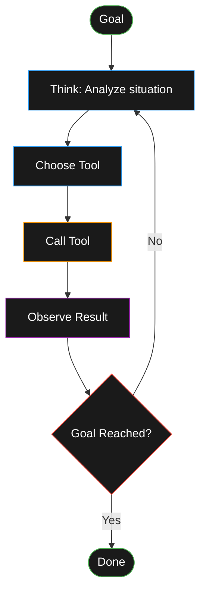

> **📖 Quick Start**
>
> - **Who it's for:** Anyone curious about AI coding agents
> - **Time to complete:** 5 minutes
> - **Prerequisites:** None
> - **Expected outcome:** Clear mental model of how agents work
> - **Next step:** [Try Amp in 15 minutes](/posts/amp-first-win-15-minutes)

Inspired by [Simon Willison's definition](https://simonwillison.net/2025/Sep/18/agents/)—"LLMs calling tools in a loop to achieve a goal"—this post keeps things simple and practical. If you remember one thing about agents, make it this: **an agent is a loop that thinks, acts with tools, observes, and repeats until done.**

## What is an Agent?

- An agent uses an LLM to decide what to do next
- It can call **tools** (functions/APIs/scripts) to act in the world
- It runs in a loop: think → act → observe → decide → repeat, guided by a goal

## The Core Loop

```text
goal → think → choose_tool → call_tool → observe_result
    → decide: done? otherwise refine plan and loop
```



## Tools an Agent Can Call

- **Files:** read/write files, list directories
- **Code:** run a snippet (e.g., Python/TypeScript) or a test
- **HTTP/APIs:** fetch JSON, call app backends, web search
- **Data:** query a database or vector index
- **System:** shell commands or task runners (with guardrails)

## A Quick Example

**Goal:** "Turn expenses.csv into a bar chart of monthly totals."

1. **Think:** "I need to read the file, group by month, and plot."
2. **Act:** Call `file.read('expenses.csv')` → observe rows
3. **Think:** "I'll write and run a small Python snippet."
4. **Act:** Call `code.run(python, script)` → observe a PNG path
5. **Decide:** Goal reached → return "Chart saved at charts/monthly.png"

> **🔨 Try It Now (2 minutes)**
>
> **Task:** Watch an agent think, act, and verify in your own codebase
>
> **Prompt:**
>
> ```text
> Read package.json, list all dependencies, and create a summary
> markdown file called deps-summary.md with total count.
> ```
>
> **Verification:**
>
> - Check that deps-summary.md was created
> - Verify the dependency count matches package.json
>
> **Expected outcome:** You'll see the agent read the file, count dependencies, create a new file, and confirm it worked—the core loop in action.

## When Does the Loop Stop?

- **Goal reached:** the result satisfies the instruction
- **Safety limits:** max steps/tokens/time reached
- **Stuck:** repeated failures or no progress detected
- **User stop:** human cancels or asks for partial results

## Why This Matters

- **Moves beyond chat:** the LLM can actually *do* things via tools
- **Robustness via iteration:** adjust after each observation
- **Composability:** clear, testable tools keep agents maintainable
- **Safety by design:** constrain tools, log actions, cap loops

## Quick FAQ

**Q: How is an agent different from ChatGPT or Copilot?**
A: ChatGPT gives you text responses. Copilot suggests code. Agents run tools in a loop—they read files, run tests, see results, and iterate until the goal is met.

**Q: What if the agent makes a mistake?**
A: Review diffs, stage good changes, discard bad ones. Git is your safety net.

**Q: Can agents write entire apps?**
A: They excel at focused tasks with clear goals. Think "fix this bug and verify" not "build me Instagram."

## What's Next

Now that you understand the core loop, it's time to experience it yourself:

**Next:** [Get Your First Win in 15 Minutes](/posts/amp-first-win-15-minutes) — Watch the agent loop in action on a real task in your codebase.

**Alternative start:** [Coding with Agents in 2025](/posts/coding-with-agents-2025) — Complete overview and mindset before diving in.

**Practice Path:**

1. **You are here**: What is an Agent
2. [First Win in 15 Minutes](/posts/amp-first-win-15-minutes)
3. [Workflows That Stick](/posts/agent-workflows-that-stick)
4. [Power Patterns](/posts/amp-power-patterns)
5. [Planning Workflow](/posts/agent-planning-workflow)

---

**Reference:** Simon Willison's [post on agents](https://simonwillison.net/2025/Sep/18/agents/) provides the foundational definition this intro builds on.
